

<h1>osTicket - Prerequisites and Installation</h1>
This project is a tuturiol meant to setup and install a guide for osTicket ticketing systemIt'll be built in microsoft azure for project ease and accessibility. It'll also be accompanied with a video highlighting install process. 

<h2>Video Demonstration</h2>

- ### [YouTube: How To Install osTicket with Prerequisites](https://www.youtube.com)

<h2>Environments and Technologies Used</h2>

- Microsoft Azure
- Remote Desktop Protocol
- Internet Information Services (IIS)

<h2>Operating Systems Used </h2>

<h2>List of Prerequisites</h2>

 Virtual machines
- osTicket install folders/dependencies
- Azure Account

<h2>High-Level Deployment and Installation Steps</h2>

> [!Important]
> Each step will include written instructions as well as corresponding screenshots.
Expand the See screenshots section to view the images.

<h3>1. CREATE WINDOWS 10 VM <h3>

The first step is to make our vm in the azure portal. Click on Virtual machines and select create new. I'm going to name the VM osTicket and I'm going to I'm going to place this VM in region East US 2. Next, we're going to choose windows 10 operating system. After that has been selected, we're going to make a username and account for to login to our vm. After you've chosen your credentials, continue to the bottom and make sure to check box asking if for windows 10/11 license. After that, just click on Review + Create.

See screenshots

See screenshots

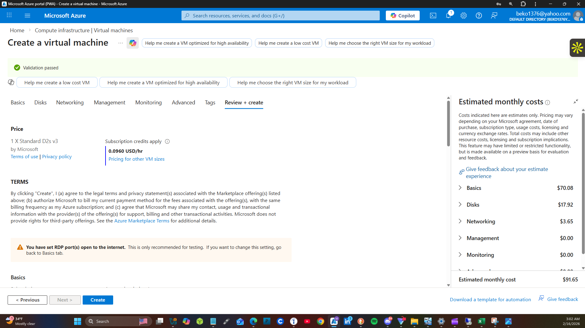

 

With the VM created, we're going to Remote Desktop Protocol into the VM and start installation of osTicket. In order to RDP, we need the public IP address of the VM. Go to the portal and click on Virtual Machines. You'll see the osTicket virtual machine status. If you look on the right side of the screen you'll see the public IP address. Copy that and click on the windows icon. Type in Remote Desktop Protocol and open the application. Type in the public ip address and press enter.

See screenshots

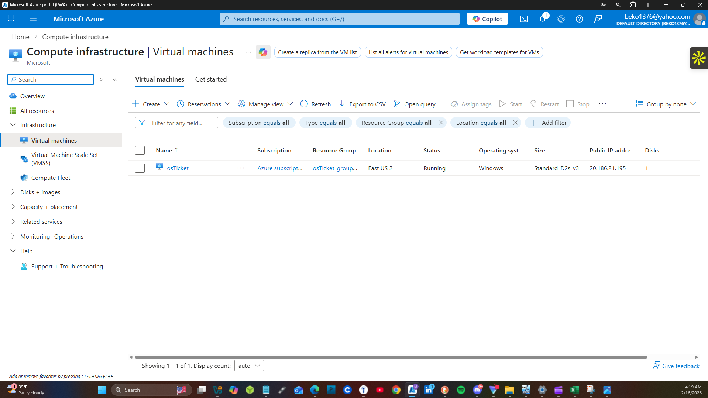

See screenshots

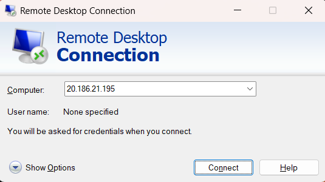

<h3>2. INSTALLING osTICKET. </h3> 

Now that we've logged in, the first thing to do is to bring the osTicket install files over to the vm and unzip them unto the desktop. I've already gathered the necessary install files for osTicket beforehand. Right-click on the osTicket-Install folder and click extract all and make sure it's extracted to the desktop.

See screenshots

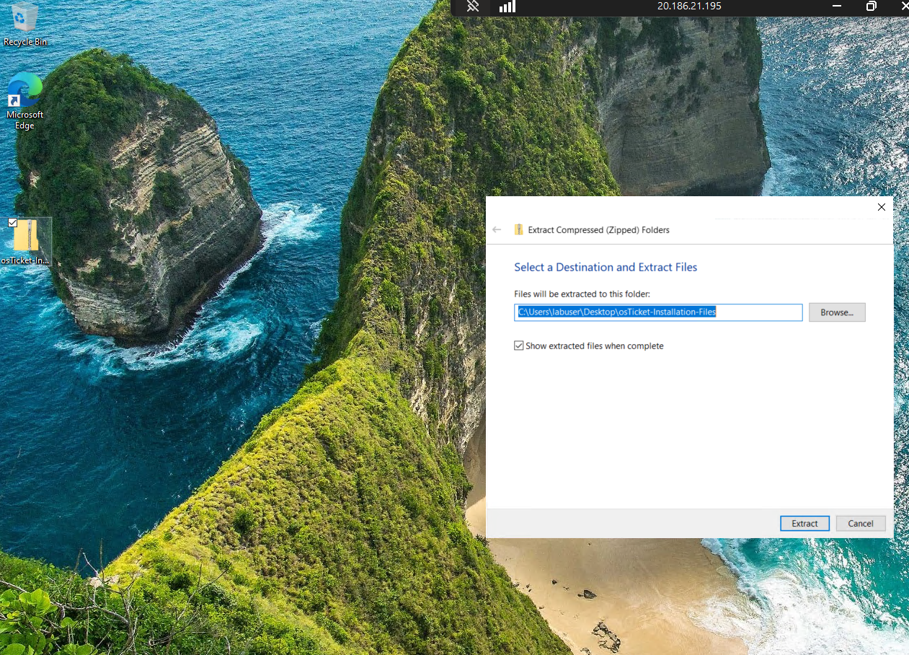

 We're going to go to the control panel and click on programs and click on Turn windows features on or off.

 

See screenshots

 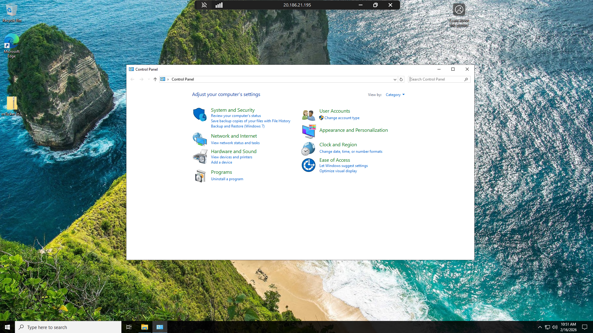

 

See screenshots

 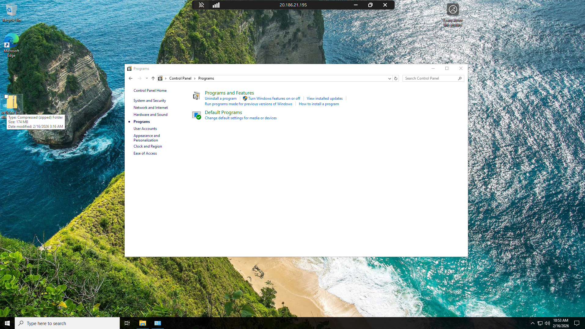
 

Go to Internet Information Services and click the box beside it. Next under IIS look for World Wide Web Services and click on the dropbox and click on Application Development Features and click on enable CGI.

See screenshots

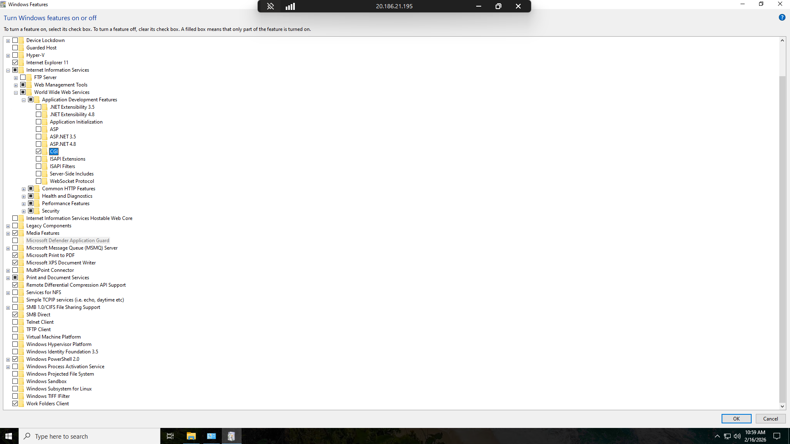

**Notes**
So what is happening is after enabling the IIS feature, we're now able to go in and configure our server for osTicket. If you would type in 127.0.0.1 in a web browser then you could see the change in the server from the time IIS was disabled to the time after it's enabled and notice the change of the server. 

See screenshots

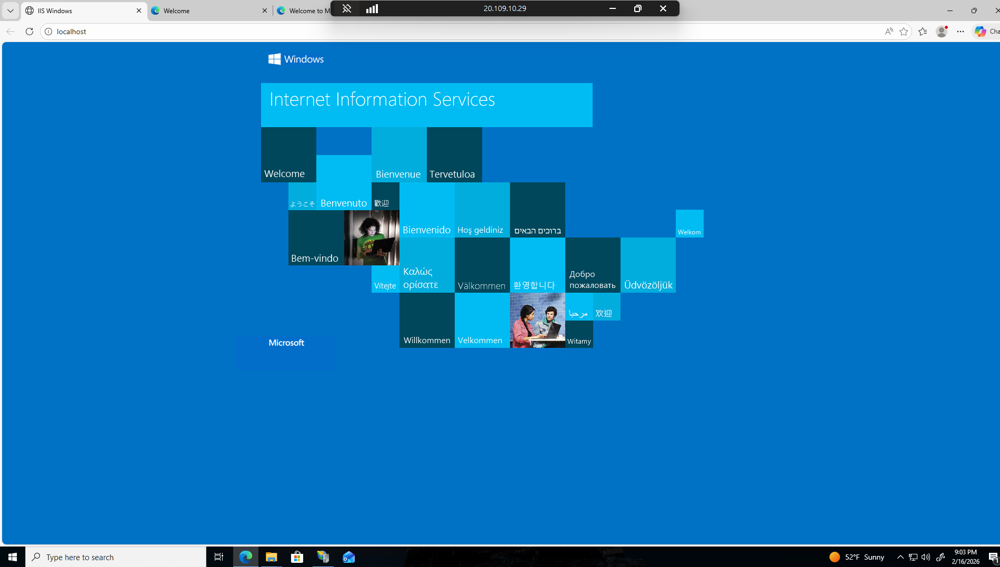

Next is to install PHP manager for IIS from the osTicket-Install Files that we're extracted to the desktop.
 

See screenshots

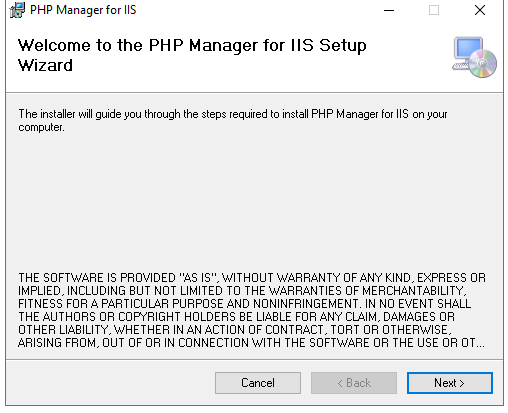

Next we're going to install the Rewrite Module (rewrite_amd64_en-US.msi).

See screenshots

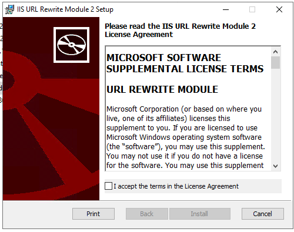

Once that's installed, we're going to create a directory named PHP on our C:\ drive. Next we're going to unzip the PHP folder into the newly created C:/PHP folder

See screenshots

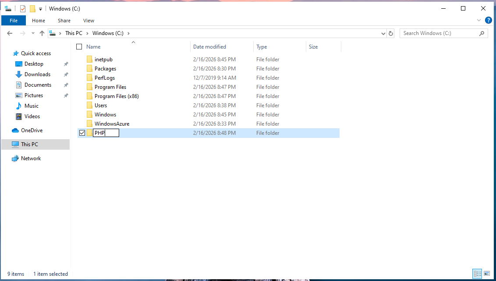

Next we're going to unzip the PHP folder into the newly created C:/PHP folder

See screenshots

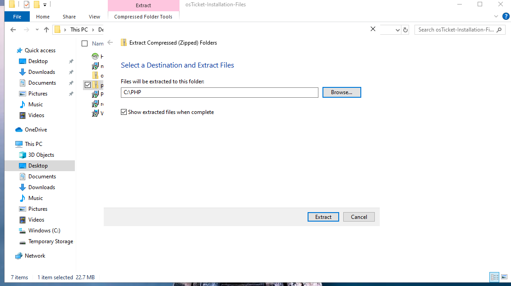

After the PHP folder has been extracted, the next step is to install the VC_redist.x86.exe from the osTicket install files folder.

Once the VC_redist.x86.exe file has been installed, the next step is to install the MySQL 5.5.62 file from the osTicket install folder

See screenshots

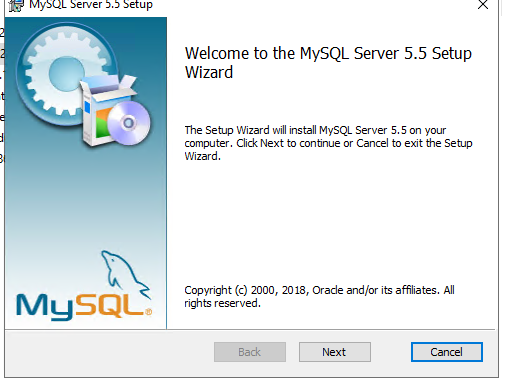

Now make sure to pick the typical option for the installation process

See screenshots

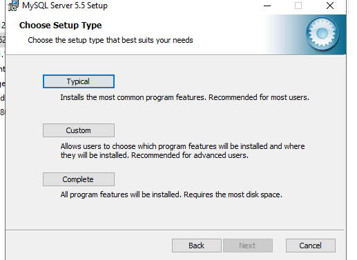

Next launch the configuration wizard after the install has finished and choose the standard configuration to continue the setup

See screenshots

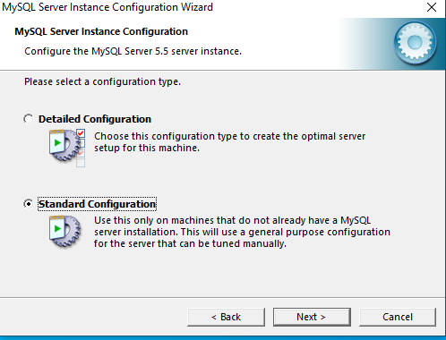

On the next screen, just click continue and go to the following screen

See screenshots

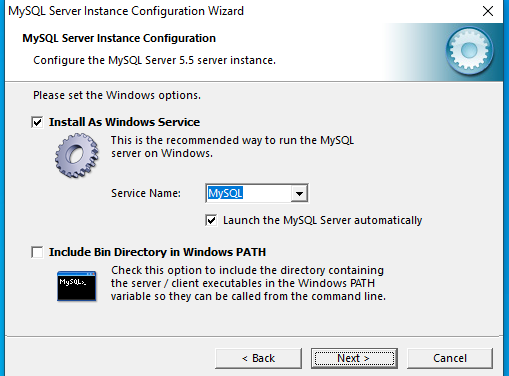

So for this next step, we're setting the password that's going to be used to log into our MySQL server once it's configured. Now you wouldn't do this in a production environment but for the sake of time, I'm going to make the password root. This is very bad so make sure not do this in an actual production environment.

See screenshots

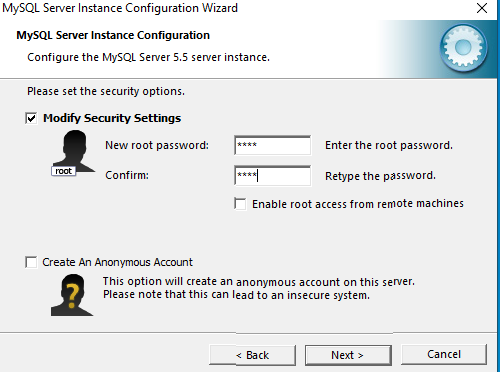

On the next screen, just click execute and wait for the configuration to complete.

See screenshots

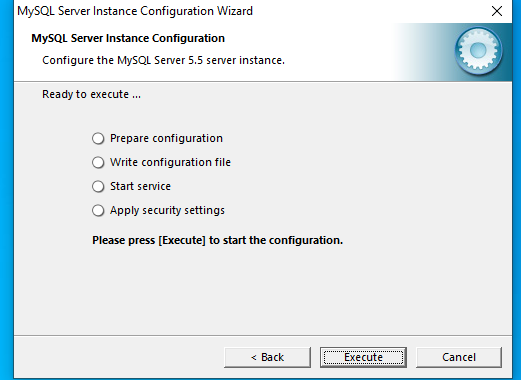

The next step is to Open IIS as an Admin and Register PHP from within IIS.

See screenshot

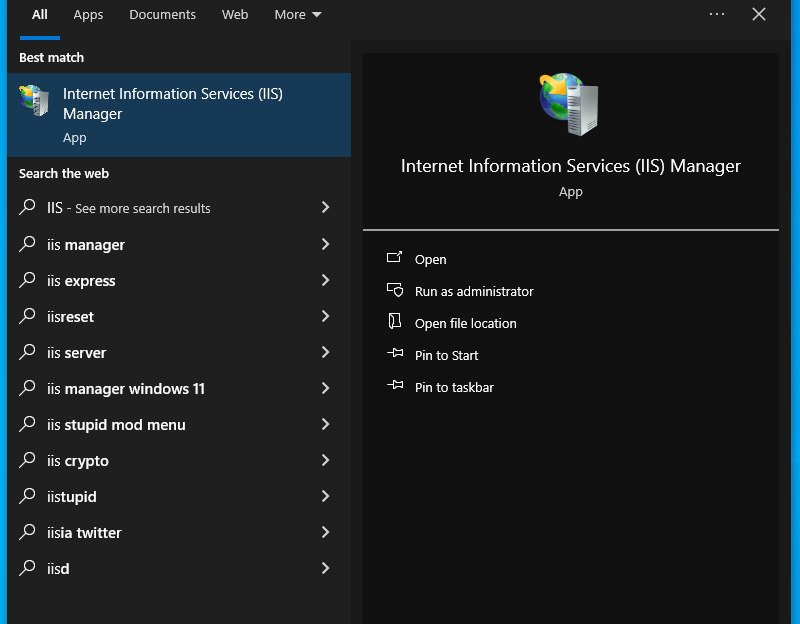

See screenshot

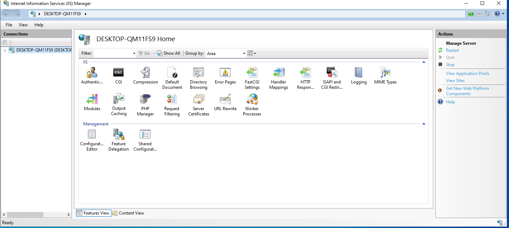

See screenshot

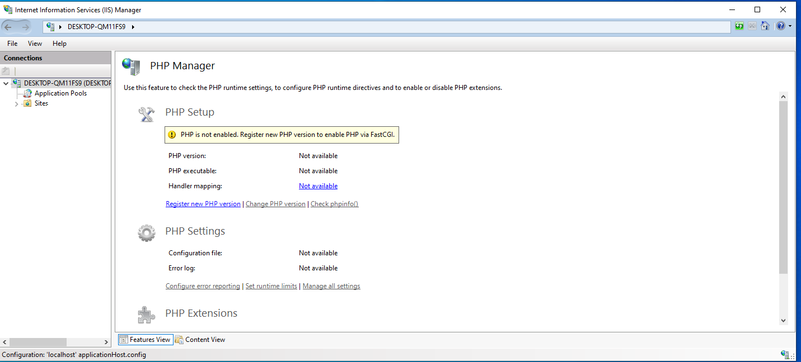

See screenshot

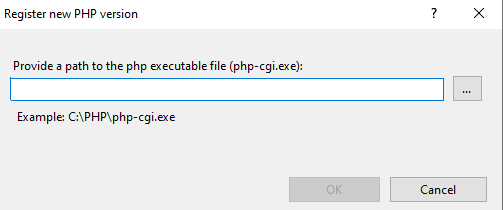

 

